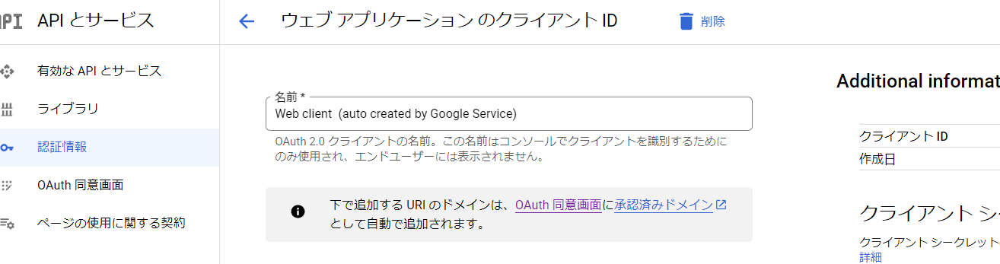

# To-Do

## DB設計
users/
├ userA
│   └ tasks/
│       ├ taskA
│       └ taskB

User
- createdAt Timestamp
- updatedAt Timestamp

Task
- createdAt Timestamp
- updatedAt Timestamp
- title String
- description String
- until Timestamp
- images String[]
- status String(enum: undone, completed)

## Google認証
https://zenn.dev/kazutxt/books/flutter_practice_introduction/viewer/30_chapter4_authentication#google%E3%82%A2%E3%82%AB%E3%82%A6%E3%83%B3%E3%83%88%E3%81%AB%E3%82%88%E3%82%8B%E8%AA%8D%E8%A8%BC

keytool
`keytool -genkey -v -keystore .android/debug.keystore -alias androiddebugkey -keyalg RSA -validity 10000 -dname "CN=Android Debug,O=Android,C=US"`
`keytool -list -v -keystore .android/debug.keystore`

WEB対応は https://qiita.com/corocn/items/f420f32a1633f2c97b1d
